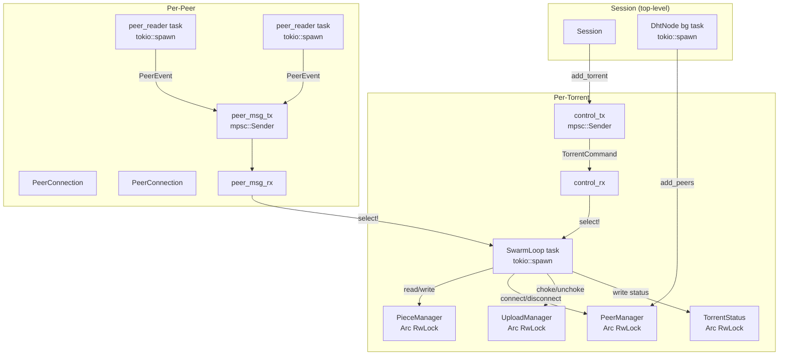

# Event-Driven Design

## When to Use

- Adding a new event source to the `SwarmLoop::select!` multiplexer
- Spawning a new background task (peer reader, DHT poller, periodic tick)
- Introducing a new `tokio::sync::mpsc` channel between components
- Modifying the torrent lifecycle state transitions (Queued → Downloading → Seeding)
- Adding config-driven timer intervals or timeouts
- Designing how a new protocol feature plugs into the event loop
- Reviewing PRs that touch `tokio::spawn`, `select!`, `JoinSet`, or channel usage
- Debugging task cancellation, channel backpressure, or timer drift issues

## Core Design Rules

1. **Per-entity tasks, not global loops**. Each torrent gets its own `SwarmLoop`. Each peer gets its own reader task. The DHT gets one background task. Never put unrelated entities in the same task.

2. **`mpsc` fan-in, not shared mutable state for events**. All peer messages fan into the download loop via a bounded `mpsc` channel. Never use `Arc<RwLock<Vec<Event>>>` as an event queue — it requires polling and has no backpressure.

3. **`select!` for multiplexing, not manual polling**. The download loop uses `tokio::select!` with 6 branches (control, peer messages, 4 timer ticks). Always add new periodic work as a `tokio::time::interval()` branch, never as a sleep-loop inside another branch.

4. **Config-driven intervals and timeouts**. Every timing parameter must come from `SessionConfig`. Never hardcode a duration literal in a `tokio::time::sleep()` or `interval()`. See the config table below.

5. **Bounded channels with graceful degradation**. Use `mpsc::channel(capacity)` (not `unbounded_channel`). When full, the producer should log a warning and exit or drop the message — never block the producer indefinitely.

6. **`JoinSet` for bounded parallelism**. Use `JoinSet` when firing N concurrent operations (peer connections, DHT queries, tracker announces). Always wrap `join_next()` in `tokio::time::timeout()` to prevent slow operations from blocking the event loop.

7. **Separate `Mutex` for read and write halves**. Split `TcpStream` into `OwnedReadHalf` + `OwnedWriteHalf` with independent `Mutex` guards. The reader task and writer code path never contend on the same lock.

## Architecture Overview



**Three task levels**: Session (DHT), Torrent (SwarmLoop), Peer (reader tasks). Communication flows downward via `tokio::spawn` and upward via `mpsc` channels.

## Channel Catalog

| Channel     | Type      | Capacity                     | Producer                   | Consumer              | Payload                   |
| ----------- | --------- | ---------------------------- | -------------------------- | --------------------- | ------------------------- |
| `peer_msg`  | `mpsc`    | `peer_msg_buffer_size` (256) | N × peer reader tasks      | SwarmLoop `select!`   | `(SocketAddr, PeerEvent)` |
| `control`   | `mpsc`    | 16                           | `TorrentHandle` public API | SwarmLoop `select!`   | `TorrentCommand`          |
| DHT oneshot | `oneshot` | 1 per query                  | DHT RPC dispatch loop      | `send_query()` caller | KRPC response             |

**Backpressure behavior**: `peer_msg` is bounded to 256. When the download loop is slower than N peer readers, `send()` returns an error and the peer reader task exits gracefully (logged at `warn` level). This is intentional — it prevents unbounded memory growth.

## Shared State Catalog

All shared state uses `Arc<RwLock<T>>` for concurrent read/write access:

| State                                        | Lock     | Writers                                     | Readers                         |
| -------------------------------------------- | -------- | ------------------------------------------- | ------------------------------- |
| `torrents: HashMap<InfoHash, TorrentHandle>` | `RwLock` | `add_torrent`, `remove_torrent`             | DHT poller, status queries      |
| `peer_mgr: PeerManager`                      | `RwLock` | SwarmLoop (connect/remove), DHT (add_peers) | SwarmLoop (pending count)       |
| `piece_mgr: PieceManager`                    | `RwLock` | SwarmLoop (set_piece)                       | SwarmLoop (bitfield, selection) |
| `status: TorrentStatus`                      | `RwLock` | SwarmLoop every 1s                          | `torrent_status()` public API   |
| `upload_mgr: UploadManager`                  | `RwLock` | SwarmLoop (choke round)                     | Per-request (choke check)       |

**Rule**: Never hold an `RwLock` write guard across an `.await` point. Write guards are always scoped to a `{ ... }` block or dropped before any async call.

## SwarmLoop `select!` Branches

The central event multiplexer in `crates/torrent/src/session/swarm/mod.rs`:

```
tokio::select! {
    // --- External control ---
    cmd = control_rx.recv()           → Pause / Resume / Cancel
                                       → Channel closed → exit loop

    // --- Peer messages (fan-in) ---
    Some((addr, event)) = peer_msg_rx.recv()
                                       → handle_peer_event()
                                       → fill_pipelines() to reassign blocks

    // --- Periodic ticks ---
    _ = status_tick.tick()            → 1s:  rates, progress, announce, connect_pending
    _ = choke_tick.tick()             → 10s: tit-for-tat + optimistic unchoke + snubbing
    _ = stale_tick.tick()             → 30s: expire timed-out requests, disconnect dead peers
    _ = pex_tick.tick()               → 60s: broadcast PEX (BEP 11) to LTEP-capable peers
}
```

### Adding a New `select!` Branch

1. Add a config field in `SessionConfig` (e.g., `new_interval: Duration`)
2. Create the interval in `SwarmLoop::new()`: `let new_tick = tokio::time::interval(config.new_interval);`
3. Add the branch to `select!` with a handler method
4. Ensure the branch is cancellation-safe (no `.await` on non-cancellation-safe resources inside the handler without proper guards)

## All `tokio::spawn` Sites

| #   | Location                  | What It Manages                      | Lifetime                         | Config                         |
| --- | ------------------------- | ------------------------------------ | -------------------------------- | ------------------------------ |
| 1   | `session/mod.rs`          | DHT background peer discovery poller | Session lifetime                 | `dht_poll_interval` (30s)      |
| 2   | `session/swarm/mod.rs`    | SwarmLoop (one per torrent)          | `add_torrent` → `remove_torrent` | All `SessionConfig`            |
| 3   | `session/swarm/peer.rs`   | Peer reader (one per connection)     | Connection lifetime              | —                              |
| 4   | `session/peer_manager.rs` | Peer TCP connections (JoinSet batch) | Per connect batch                | `peer_connect_timeout` (500ms) |
| 5   | `dht/rpc.rs`              | DHT UDP receive loop                 | DhtNode lifetime                 | —                              |
| 6   | `dht/node.rs`             | DHT periodic bootstrap               | DhtNode lifetime                 | `BOOTSTRAP_INTERVAL`           |
| 7   | `dht/node.rs`             | DHT get_peers parallel queries       | Per lookup                       | —                              |

### Spawning Rules

- **Use `tokio::spawn`** for fire-and-forget long-lived tasks (reader loops, DHT poller, SwarmLoop).
- **Use `JoinSet`** for bounded parallel operations where you need results (peer connections, DHT lookups, tracker announces).
- **Always `.await` spawned task handles** when the owner is dropped (e.g., `Session::remove_torrent` awaits the SwarmLoop `JoinHandle`).
- **Never `tokio::spawn` inside `torrent-core`** — that crate is sync-only by hard rule.

## Torrent Lifecycle State Machine

```
                    add_torrent()
                         │
                         ▼
                    ┌─────────┐
                    │ Queued  │──── tokio::spawn(SwarmLoop) ────┐
                    └─────────┘                                    │
                         ▲                                         ▼
                         │                                    ┌─────────────┐
                    capacity freed                            │ Downloading │
                         │                                    └─────────────┘
                         │                                      │         │
                         │                               pause  │         │  all pieces done
                         │                                      ▼         ▼
                         │                               ┌─────────┐  ┌─────────┐
                         │                               │ Paused  │  │ Seeding │
                         │                               └─────────┘  └─────────┘
                         │                                   │              │
                         │                            resume │              │
                         │                                   ▼              │
                         │                               ┌─────────────┐    │
                         └────────────────────────────── │ Downloading │ ◄──┘
                                                 cancel  └─────────────┘
                                                           │
                                                           ▼
                                                     (task exits)
```

**Key transitions:**

- `Queued → Downloading`: On `SwarmLoop::run()` entry
- `Downloading → Paused`: On `TorrentCommand::Pause`
- `Paused → Downloading`: On `TorrentCommand::Resume`
- `Downloading → Seeding`: When `missing_pieces().is_empty()` (continues to upload)
- `Any → exit`: On `TorrentCommand::Cancel` or `control_tx` dropped

## Config-Driven Behavior

Every timing and capacity parameter flows from `SessionConfig`. See `crates/torrent/src/session/config.rs`:

| Config Field                 | Default | Drives                                |
| ---------------------------- | ------- | ------------------------------------- |
| `max_connections`            | 50      | PeerManager connection cap            |
| `max_uploads`                | 8       | UploadManager unchoke limit           |
| `max_concurrent_pieces`      | 5       | Active pieces in parallel             |
| `piece_cache_size`           | 256     | LRU cache for upload serving          |
| `endgame_threshold`          | 10      | Switch RarestFirst → EndGame selector |
| `request_timeout`            | 60s     | `stale_tick` expiry check             |
| `peer_connect_timeout`       | 500ms   | `connect_pending()` per-call timeout  |
| `peer_max_retries`           | 3       | Retries before discarding             |
| `peer_cooldown`              | 30s     | Reconnect delay after failure         |
| `choke_interval`             | 10s     | `choke_tick` frequency                |
| `snub_timeout`               | 60s     | Choke idle peers threshold            |
| `announce_fallback_interval` | 30s     | Re-announce after tracker failure     |
| `tracker_timeout`            | 15s     | HTTP/UDP tracker timeout              |
| `dht_poll_interval`          | 30s     | DHT discovery loop frequency          |
| `pex_interval`               | 60s     | PEX broadcast frequency               |
| `peer_msg_buffer_size`       | 256     | `mpsc` channel capacity               |
| `max_active_torrents`        | 0 (∞)   | Reject add_torrent at capacity        |

## JoinSet Patterns

### Pattern 1: Peer Connection (Bounded Parallelism with Timeout)

```rust
// crates/torrent/src/session/peer_manager.rs
let mut joinset = JoinSet::new();
let batch_size = (max_connections - current).min(pending_count);

for &addr in pending.iter().take(batch_size) {
    joinset.spawn(async move {
        let result = PeerConnection::connect(addr, info_hash, peer_id).await;
        (addr, result)
    });
}

// Collect with per-call timeout — fast peers aren't blocked by slow ones
loop {
    match tokio::time::timeout(per_call_timeout, joinset.join_next()).await {
        Ok(Some(Ok((addr, Ok(conn))))) => {
            // Success → add to active connections, spawn reader
        }
        Ok(Some(Ok((addr, Err(_))))) => {
            // Failure → backoff, re-enqueue up to max_retries
        }
        Ok(None) => break,                          // all done
        Err(_elapsed) => { /* timeout */ break; }   // remaining re-enqueued
    }
}
```

### Pattern 2: Tracker Multi-Announce (Deferred JoinSet)

```rust
// crates/torrent/src/tracker/mod.rs
pub fn announce_into_set(&self, req: &AnnounceRequest) -> JoinSet<...> {
    let mut set = JoinSet::new();
    for inner in &self.trackers {
        set.spawn(async move { inner.announce(req).await });
    }
    set  // caller drives collection
}
```

The caller controls how results are collected — individual results, first success, or all.

## Lock Isolation: PeerConnection

```rust
// crates/torrent/src/peer/stream.rs
pub struct PeerConnection {
    reader: Mutex<BufReader<OwnedReadHalf>>,   // independent lock
    writer: Mutex<BufWriter<OwnedWriteHalf>>,   // independent lock
    // ...
}
```

The `TcpStream` is split with `into_split()`. The peer reader task locks only `reader`, and the download loop locks only `writer` when sending messages. This enables true full-duplex concurrency — read and write never contend on the same mutex.

**Anti-pattern**: Never use a single `Mutex<TcpStream>` for both read and write. This serializes all I/O and kills throughput.

## Task Cancellation & Cleanup

### Graceful Shutdown Chain

When the user calls `Session::remove_torrent()`:

```
1. handle.cancel().await
   └─ Sends TorrentCommand::Cancel via control_tx

2. let _ = handle.task.await
   └─ Awaits SwarmLoop JoinHandle

3. SwarmLoop::run() exits
   └─ select! branches all drop

4. peer_msg_tx is dropped
   └─ All peer reader tasks see closed channel
   └─ Each reader task exits its loop

5. PeerConnection drops are cleaned up
```

**Rule**: The owner of a channel sender must be dropped AFTER the receiver task is awaited. Dropping the receiver first causes senders to error. Dropping senders first causes the receiver to see `None` and exit.

## Common Pitfalls

### Holding RwLock Across .await

```rust
// ❌ WRONG: write guard held across .await
let mut mgr = self.peer_mgr.write().await;
mgr.connect(some_future().await);  // DEADLOCK RISK

// ✅ RIGHT: scope the write guard
let addr = {
    let mgr = self.peer_mgr.read().await;
    mgr.next_pending()
};
PeerConnection::connect(addr).await;
```

### Unbounded Channels

```rust
// ❌ WRONG: unbounded channel can OOM
let (tx, rx) = mpsc::unbounded_channel();

// ✅ RIGHT: bounded channel with backpressure
let (tx, rx) = mpsc::channel::<T>(config.peer_msg_buffer_size);
```

### Hardcoded Durations

```rust
// ❌ WRONG: magic number
tokio::time::sleep(Duration::from_secs(30)).await;

// ✅ RIGHT: config-driven
tokio::time::sleep(config.dht_poll_interval).await;
```

### Missing Timeout on JoinSet

```rust
// ❌ WRONG: slow peer blocks the entire connection batch
while let Some(result) = joinset.join_next().await { ... }

// ✅ RIGHT: per-call timeout
while let Ok(Some(result)) =
    tokio::time::timeout(Duration::from_millis(500), joinset.join_next()).await
{ ... }
```

### Single Mutex for Read/Write

```rust
// ❌ WRONG: read and write serialize each other
pub struct PeerConnection {
    stream: Mutex<TcpStream>,
}

// ✅ RIGHT: split into independent locks
pub struct PeerConnection {
    reader: Mutex<BufReader<OwnedReadHalf>>,
    writer: Mutex<BufWriter<OwnedWriteHalf>>,
}
```

### Spawning in torrent-core

```rust
// ❌ WRONG: torrent-core is sync-only
// In crates/torrent-core/src/...:
tokio::spawn(async { ... });  // COMPILE ERROR: no tokio dependency

// ✅ RIGHT: spawn only in the torrent crate
// In crates/torrent/src/...:
tokio::spawn(async { ... });
```

## Testing Event-Driven Code

- **Unit tests for channels**: Test that senders error when receivers are dropped, and vice versa.
- **Unit tests for timers**: Use `tokio::time::pause()` to control time in tests.
- **Integration tests for task lifecycle**: Test `add_torrent → cancel → await task` to verify clean shutdown.
- **No real network**: All tests must use mock or localhost connections. Never rely on external trackers or peers.
- **`#[tokio::test]` only in the `torrent` crate**: `torrent-core` tests are fully synchronous.
